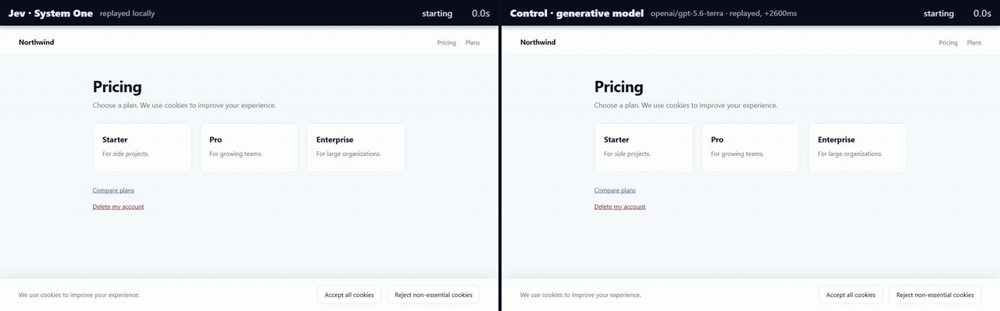

# Jev examples

Working examples of [Jev](https://docs.typesafe.ai) — TypeSafe AI's "System One"
evaluation model — using the official [`@typesafe-ai/sdk`](https://www.npmjs.com/package/@typesafe-ai/sdk),
paired with the [Vercel AI SDK](https://ai-sdk.dev) and
[AI Gateway](https://vercel.com/ai-gateway) for the generative half of an agent.

Examples 01–04 run right now, with no API key and no setup beyond `npm install`.
Examples 05 and 06 drive a real Chrome and record it; they need a one-time
browser download, so they are opt-in.

```bash
npm install
node examples/01-quickstart.ts
```

### Jev vs a conventional generative agent



Same task, same page, same driver, same click mechanics — only the decision
model differs. Left is Jev; right is an ordinary `generateObject` agent. Jev has
already decided and escalated the ambiguous cookie banner to a human while the
control is still generating. Produced by
[`06-jev-vs-control.ts`](examples/06-jev-vs-control.ts) with `npm run compare`;
read [what is and is not measured](#06-jev-vs-controlts--jev-against-a-control-model)
before drawing conclusions from the clock.

---

## What Jev is

Jev is not a chat model. It does not write text, and there is nothing to parse.

You hand it a **state** — a string, an object, a message list, whatever you
already have — and a map of **typed questions**. It returns typed answers with
probability distributions attached.

```ts
import { TypeSafeClient, choice, noul, score } from '@typesafe-ai/sdk';

const client = new TypeSafeClient(); // reads TYPESAFE_API_KEY

const { answers } = await client.systemOne({
  state: { subject: 'Charged twice', body: '...' },
  questions: {
    department: choice('Which team owns this?', { billing: '...', technical: '...' }),
    severity: score('How severe?', ['Cosmetic', 'Degraded', 'Blocked', 'Outage']),
    wantsRefund: noul('Is the customer asking for money back?'),
  },
});

answers.department.choice;        // 'billing'  (typed to the option keys)
answers.department.probabilities; // { billing: 0.52, technical: 0.30, ... }
answers.severity.score;           // 2.70, continuous in [0, 3]
answers.wantsRefund.noul;         // 0.97
```

Three primitives, and that is the whole surface:

| Primitive  | Builder    | You get back                                           |
| ---------- | ---------- | ------------------------------------------------------ |
| **Choice** | `choice()` | `choice` + `probabilities` over your option keys        |
| **Score**  | `score()`  | `score` in `[0, levels-1]` + `probabilities` per level  |
| **Noul**   | `noul()`   | `noul` — a probability in `[0, 1]`                      |

("Noul" is TypeSafe's term for a yes/no probability. The AI SDK renames it to
`boolean`/`probability`; see [`docs/SDKS.md`](docs/SDKS.md) for the full
mapping, which is where porting bugs come from.)

Two properties drive the whole design:

1. **Questions are evaluated in parallel and in isolation.** Ten questions cost
   roughly what one costs in latency. Adding a question cannot degrade the
   answer to another one.
2. **Questions cannot read each other's answers.** If decision B depends on
   answer A, that is a second request — and usually it is a branch in your code
   instead.

It is cheap enough to put in a loop: **\$0.042 per 1M input tokens**, zero output
tokens, because there is no output to generate.

## What Jev is not

It is not an agent, a planner, a harness, or a tool router. TypeSafe's own
position is that **Jev is never the harness** — it is a decision point inside a
loop your code owns:

| Job                    | Owner               |
| ---------------------- | ------------------- |
| Interpret, propose     | a generative model  |
| **Judge, classify, gate** | **Jev**          |
| Decide whether to act  | **your code**       |
| Execute                | your tool runner    |
| Update state           | **your code**       |
| Explain the result     | a generative model  |

Example 03 is built around that table.

---

## The examples

### [`01-quickstart.ts`](examples/01-quickstart.ts) — one request, five questions

Triages a support ticket: one Choice, two Scores, two Booleans, in a single
call. Shows the distributions, then makes the routing decision in plain
TypeScript — including refusing to auto-route when confidence is low.

```
Choice — department: billing
  billing    ████████████············  52.0%
  technical  ███████·················  30.0%
  sales      ███·····················  12.0%
  selected probability 52.0% · confidence 18.9%

Score — severity: 2.70 of 3
  3 Revenue-affecting outage with no workaround  ███████████████████·····  77.5%
  2 A core workflow is blocked                   ████····················  16.9%

Routing decision (plain code)
  route to        triage queue (confidence 18.9% too low to auto-route)
  refund          auto-open refund case
```

The point: **ask everything at once, then decide in code.** Extra questions are
close to free, so ask the speculative ones too — you can ignore an answer, but
you cannot go back in time for it.

### [`02-judge-rubrics.ts`](examples/02-judge-rubrics.ts) — model-as-a-judge with rubrics

Scores three candidate responses against the same five-question rubric, then
combines dimensions with weights you own.

```
Per-dimension, normalized to 0..1
  candidate   factual  complete  tone
  model-a        0.97      0.97  0.90
  model-c        0.03      0.55  0.95

Composite score, same measurements, two weightings
  candidate   support-quality  brand-voice   verdict
  model-a               0.956        0.935   PASS
  model-c               0.372        0.595   FAIL

Hard gates tripped (checked separately, never weight-averaged)
  ✗ model-c: invents policy (97%), claims an irreversible action (95%)
```

Two rules this example exists to demonstrate:

1. **Normalize a Score by `levels - 1`.** A 4-level rubric returns `[0, 3]`.
2. **"Any serious violation" is a separate condition, never a small weight.** A
   weighted average is a *compensating* model: a great tone score will happily
   pay for a hallucinated refund policy. `model-c` writes the warmest reply in
   the set and is exactly the answer that costs you money.

Because the weights are ordinary numbers, changing what you value is a
coefficient change and not a prompt rewrite — the same measurements produce
both the `support-quality` and `brand-voice` rankings above.

### [`03-agent-harness.ts`](examples/03-agent-harness.ts) — Jev in a harness

Two models, two jobs. The **Vercel AI SDK** (`generateObject` + `gateway`)
proposes each next command. **Jev** judges it: which model to route to, whether
the command is `clear` or `caution`, whether it is irreversible, how much it
advances the goal, whether the goal is met, and whether the agent is stuck. The
loop, the budget and every actual decision are plain TypeScript.

```
Route  goal -> powerful (p=83.0%, confidence=34.2%)
  proposer: openai/gpt-6-astra via MockLanguageModelV4 (ai/test)

step 2  grep -c "OutOfMemoryError" /workspace/logs/checkout.log
  permission=clear p=93.0% · irreversible=2.0% · advances=2.40/3 · goalMet=18.0%
  RUN  17

step 3  rm -rf /workspace/logs/*.log && systemctl restart checkout
  permission=caution p=97.0% · irreversible=96.0% · advances=0.40/3 · goalMet=5.0%
  HOLD escalate to a human — classified caution, irreversible 96.0%

step 4  sed -n "1,80p" /workspace/logs/checkout.log
  permission=clear p=94.0% · advances=2.90/3 · goalMet=93.0%
  RUN  java.lang.OutOfMemoryError: Java heap space
  DONE goal met at 93.0%
```

The blocked command is fed back to the proposer as an `avoid` list, so the
generative model routes around the gate instead of retrying into it.

The permission gate mirrors Vercel's `eve` framework (`eve/tools/approval`,
`auto()`), which asks exactly **one** Choice question with id `permission` and
criteria `clear` / `caution`, then maps `clear` → approved and *everything
else, including a failed call* → human approval. Fail-closed is the whole
design: a timeout must not become a `rm -rf`.

Note the two-request structure. Routing happens first, because the per-step
questions are asked against a state that already includes the chosen model —
questions in one request cannot consume each other's answers.

### [`04-browser-use.ts`](examples/04-browser-use.ts) — browser use

The loop is `settle → describe → evaluate → act`. Your code enumerates the
interactive elements on the page and gives Jev their ids as Choice options, plus
a `none` option. The model picks from that list.

```
step 1  /pricing
  4 candidates · ~80 tokens of page state
  target=e1 p=46.0% · confidence=20.6% · goalMet=1.0%
  AMBIGUOUS distribution is split; not clicking on a coin flip
  shortlist handed to the caller:
    e1 "Accept all cookies" 46.0%
    e2 "Reject non-essential cookies" 31.4%
  HUMAN chose e2 "Reject non-essential cookies"

step 3  /pricing/pro
  target=none p=86.0% · confidence=55.5% · goalMet=96.0%
  DONE answer found on this page
```

The agent never resolves its own ambiguity. It stops, emits the shortlist, and
waits; a person picks. If nobody is available to pick, the run ends with status
`ambiguous` rather than proceeding on a 46% guess.

Why this shape beats "ask an LLM for a selector":

- **The model cannot invent a selector.** It chooses among elements that already
  exist in your DOM snapshot. There is nothing to hallucinate and nothing to
  parse.
- **A split distribution is a usable signal**, not a failure. Community
  implementations turn it into a status enum — `done`, `likely_done`,
  `needs_login`, `needs_confirmation`, `ambiguous`, `blocked`, `stuck` — and the
  caller decides. This example does the same.
- **The token cost is small enough to run every step.** Community write-ups
  report roughly ~8k tokens for a task where a Playwright-MCP agent burned
  ~557k. Those are self-reported, unaudited numbers, but the direction is not
  surprising: you send element labels, not a page.

Prior art worth reading, all MIT and all unofficial — there is no official
TypeSafe browser example: [`Ying-Kai-Liao/jev-browser`](https://github.com/Ying-Kai-Liao/jev-browser)
(best-documented), [`jkudish/jev-browser`](https://github.com/jkudish/jev-browser),
[`moritzkremb/jev-voice-browser`](https://github.com/moritzkremb/jev-voice-browser).

This example simulates a three-page site so it runs without Playwright. The
`describe → evaluate → act` contract is what you would keep.

### [`05-browser-live.ts`](examples/05-browser-live.ts) — the same loop, against real Chrome

Example 04's argument, with the simulation removed. Chrome launches, the
elements come from the real DOM over CDP, the cursor moves to real coordinates
and the clicks are real input events. The decision policy is imported from
[`src/browser-policy.ts`](src/browser-policy.ts) and shared verbatim with
example 04; everything that is not the decision lives in
[`src/browser-driver.ts`](src/browser-driver.ts). Only the arm differs.

```bash
npm run record                 # writes docs/media/browser-use.mp4
npm run record -- --no-video   # drive the browser, skip encoding
```

It records itself with [`webreel`](https://www.npmjs.com/package/webreel), which
owns the cursor animation, the click overlay and the ffmpeg pipeline.

**Not zero-setup.** webreel downloads Chrome and ffmpeg into `~/.webreel` on
first run — a few hundred MB — which is why 05 and 06 are excluded from
`npm run all`.

### [`06-jev-vs-control.ts`](examples/06-jev-vs-control.ts) — Jev against a control model

The same task run twice through the same driver, recorded, and stitched
side by side.

| | Jev | Control |
|---|---|---|
| call | one `systemOne` | one `generateObject` |
| returns | a distribution over the elements, plus four scalars | one element id and a self-reported confidence |
| harness can gate on | the shape of the distribution | nothing trustworthy |
| the cookie banner | flat distribution → stops and asks | one answer → clicks it |

```bash
npm run compare                # writes docs/media/jev-vs-control.{mp4,gif}
npm run compare -- --no-video
```

The control is not a straw man. It gets the same page description and a strict
schema, which is how you are supposed to make a language model drive a UI. The
difference is structural: self-reported confidence is a token the model chose,
drawn from the same distribution as the rest of its output, and it is not a
measurement of anything. A harness handed one answer has nothing to check, so it
acts on every answer — which is what most agents in production actually do.

#### What the clock does and does not show

Read this before quoting the numbers.

- With **no keys** (the default), both arms replay scripted answers. Jev's
  decision time is ~0 because nothing leaves the process, and the control's is
  `CONTROL_THINK_MS` — a declared 2600 ms stand-in for a generation, not a
  measurement. The caption burned into each video says which mode it ran in.
- With **`TYPESAFE_API_KEY` and `AI_GATEWAY_API_KEY`** set, both arms make real
  calls and every number in the summary becomes a real measurement.
- The clicks, the DOM, the element enumeration and the escalation logic are real
  in both modes. **The recording is evidence that the loops behave as described.
  It is not a benchmark.**

The behavioural difference does not depend on the stand-in at all: it follows
from one arm returning a distribution and the other returning a single answer.

### [`examples/python/`](examples/python) — LangChain

LangChain's TypeSafe integration is **Python-only**; there is no
`@langchain/typesafe` on npm.

> **These two files have never been executed.** There was no Python environment
> and no API key in the build environment, so they are reference implementations
> read from the published `langchain-typesafe` API, not verified runs. Treat
> them as a starting point and expect to adjust.

They need `TYPESAFE_API_KEY`, and `langchain_harness.py` additionally needs a
generative provider (`OPENAI_API_KEY` as written). Neither runs offline.

- [`judge_rubric.py`](examples/python/judge_rubric.py) — the rubric judge from
  example 02, using `TypeSafeClassifier` with `Score`, `Noul` and `Choice`.
- [`langchain_harness.py`](examples/python/langchain_harness.py) —
  `ModelRouterMiddleware` and `AutoModeMiddleware`, which are the routing and
  permission gates from example 03 as drop-in middleware, plus a custom
  `before_agent` middleware showing the general shape.

```bash
pip install -r examples/python/requirements.txt
```

`langchain-typesafe` is `0.0.1a3` — alpha, with one breaking change already
behind it, and the middleware module is explicitly experimental. Pin it.
Note also that `AutoModeMiddleware` **refuses** a risky call with an error
`ToolMessage`; it does not prompt. Pair it with human-in-the-loop middleware if
you want a person in the path.

---

## FSI examples

Four of the examples above are about Jev's mechanics. These two are about a
domain: what a bounded-choice model is worth inside a regulated financial
services workflow, where the cost of a confident wrong answer is not a bad
paragraph but a wrongly frozen card or a wrongly touched production system.

Both are written to a stricter standard than examples 01–06, recorded in
[`docs/CLAIM-CONTRACTS.md`](docs/CLAIM-CONTRACTS.md) and
[`docs/FSI-BOUNDARIES.md`](docs/FSI-BOUNDARIES.md): every decision is written to
a JSONL ledger, every run is labelled as scripted, and no example is permitted
to claim a distribution deserves trust — only to show what the surrounding
application does with one.

```bash
npm run fsi:07
npm run fsi:08
npm run fsi:eval
```

### 07 — Bounded next-step recommendation

[`examples/fsi/07-next-step/index.ts`](../../examples/fsi/07-next-step/index.ts) —
a card-fraud servicing workflow in which deterministic code reads the authoritative
records, decides which next steps are even eligible, and only then asks Jev which
eligible step to try first.

```bash
npm run fsi:07
```

**This is a scripted offline fixture.** No live TypeSafe API call is made. The
model's selection and its distribution are predetermined by
[`scenarios.ts`](../../examples/fsi/07-next-step/scenarios.ts) so that each route
through the policy can be shown deterministically. The run demonstrates
application control flow, not model accuracy. No customer or transaction data is
used, no domain validation has been performed, and the thresholds are illustrative
rather than empirically selected.

#### What it may be read as showing

Bounded options are constructed by code before the model is consulted; an
abstention policy is applied to the returned distribution; execution arguments are
bound to authoritative record identifiers or exact customer text spans; a
consequential action requires named human approval, tied to an immutable proposal
digest and revalidated against a fresh read of the records; and recommendation is
recorded separately from execution so divergence between them is visible.

**What it must not be read as showing:** that Jev understands fraud reports, that
it is calibrated for banking workflow selection, that it prevents hallucination or
provides authorization, that a bounded option set implies a correct choice, that
this pattern safely automates freezes or disputes, that it reduces fraud loss,
handling time or clarification turns, or that human confirmation alone satisfies
any regulatory requirement. The binding list is
[`docs/CLAIM-CONTRACTS.md`](../CLAIM-CONTRACTS.md); anything not on it does not
ship.

#### The ordering is the point

1. Read the records.
2. Compute eligibility deterministically — entitlement first, then preconditions.
3. Offer only the eligible steps to Jev, plus `none_of_these`.
4. Apply an explicit abstention policy to the distribution.
5. Bind every execution argument to a record identifier or an exact source span.
6. Take approval against a frozen proposal digest, then revalidate against a fresh
   read before executing.

Ineligible steps are absent from the option set, not merely unlikely within it.
In the `already-frozen` scenario the card is frozen out of band before the model
is consulted, so `freeze_card` is not offered at all:

```
already-frozen — The card was frozen in the app two minutes ago
───────────────────────────────────────────────────────────────
  option set built by code from card-system-of-record@v2 read 2026-03-11T09:14:00.000Z
  offered  order_replacement_card, open_dispute, schedule_callback, send_transaction_receipt, record_customer_note
  withheld freeze_card — card is already frozen
  withheld close_case — principal customer is not entitled to close_case
```

#### Abstention

The policy runs three tests on the distribution — selected probability, margin
over the runner-up, and normalized entropy. A failed call is a refusal before any
of them, never an approval. A flat distribution is escalated rather than acted on:

```
  jev recommends send_transaction_receipt
    send_transaction_receipt  ██████████··············  42.0%
    schedule_callback         █████···················  19.3%
    record_customer_note      █████···················  19.3%
    open_dispute              ██······················   7.7%
    none_of_these             ██······················   7.7%
    freeze_card               █·······················   3.9%
    p=42.0% · margin=0.23 · entropy=0.85 · over 6 offered options
    selected probability 0.42 < 0.70; margin 0.23 < 0.25; entropy 0.85 > 0.60
  ESCALATE distribution too ambiguous to act on: selected probability 0.42 < 0.70; margin 0.23 < 0.25; entropy 0.85 > 0.60
  nothing executed; case routed to route_to_servicing_queue
```

#### Argument binding

Arguments are never taken as text. A record reference must exist in the snapshot
*and* be in the step's candidate set; a derived field must equal the authoritative
field on that record; a narrative must be an exact substring of a permitted source
document, because a near-quotation is a rewrite.

The `unbound-arguments` scenario runs a generative control arm through the same
`bindArguments()` the Jev arm uses:

```
  control arm MockLanguageModelV4 (ai/test) — scripted adversarial fixture · schema-valid, records unchecked
  REJECTED generative proposal — by bindArguments, before execution
    ✗ transactionId=TXN-88231
      no transaction with this identifier in card-system-of-record@v1
    ✗ merchantId=MERCH-ZEPHYR-INTL
      no merchant with this identifier in card-system-of-record@v1
    ✗ amountMinor=26499
      cannot be checked on its own: an amount is authoritative only relative to a
      transaction, and the referenced transaction did not resolve in card-system-of-record@v1
    ✗ narrative=Customer reports an unauthorised payment of around £265 to Zephyr.
      not an exact quotation from a permitted source document
```

**This is an adversarial fixture, not a fair benchmark.** The control arm was
scripted to propose unbound arguments. A competent generative implementation can
be constrained to enumerated record identifiers and would pass exactly the same
checks, for exactly the same reason — the checks are in the application, not in
the model. The claim is narrow: *execution arguments that are not bound to
authoritative records are rejected, regardless of which model proposed them.*

#### Where the safety properties live

Every one of them is owned by deterministic code. This is from the run, not a
summary of it:

```
ineligible action cannot be selected   computeEligibility()   deterministic
principal cannot exceed entitlement    permits()              deterministic
argument must resolve to a record      bindArguments()        deterministic
narrative must be the customer's words resolveSpan()          deterministic
consequential action needs approval    STEPS[].consequential  deterministic
approval binds to one frozen proposal  digestOf()             deterministic
state cannot go stale under approval   revalidate()           deterministic
which eligible step to try first       Jev                    unmeasured
when the case is too unclear to act    Jev + policy           unmeasured
```

#### The baseline arm

Every scenario is also run with Jev removed and static priority in its place, so
the contribution is visible rather than assumed:

```
  scenario                   jev recommended           route              harness executed          baseline
  clear-unauthorized-charge  freeze_card               approval_required  freeze_card               freeze_card
  ambiguous-report           send_transaction_receipt  escalated          route_to_servicing_queue  freeze_card
  already-frozen             open_dispute              approval_required  open_dispute              open_dispute
  unbound-arguments          open_dispute              approval_required  open_dispute              freeze_card
  stale-state                open_dispute              approval_required  route_to_servicing_queue  freeze_card
  service-unavailable        (none)                    refused            route_to_servicing_queue  freeze_card
```

The baseline refuses everything this run refused — it goes through the same
eligibility, binding, approval and revalidation code. What it cannot do is
abstain: static priority always has an answer, which is why it would have frozen a
card on the ambiguous report. Jev's contribution here is prioritization and
preselection, and **that benefit is unmeasured by this repository.** Whether it is
worth anything in a real servicing workflow is one of the open questions in
[`docs/FSI-BOUNDARIES.md`](../FSI-BOUNDARIES.md).

#### Divergence

Recommendation and execution are recorded separately and the difference is
derived, not asserted:

```
  approval_required  recommended=freeze_card                  executed=freeze_card
  escalated          recommended=send_transaction_receipt     executed=route_to_servicing_queue  ⚠ diverged
  approval_required  recommended=open_dispute                 executed=open_dispute
  refused            recommended=(none)                       executed=route_to_servicing_queue  ⚠ diverged
  approval_required  recommended=open_dispute                 executed=open_dispute
  approval_required  recommended=open_dispute                 executed=route_to_servicing_queue  ⚠ diverged
  refused            recommended=(none)                       executed=route_to_servicing_queue
```

The ledger is evidence capture that may support governance. It is not an audit
trail: not tamper-evident, not immutable, not independently verified, and a hashed
state reference is not anonymization.

---

### 08 — Residual incident runbook routing

[`examples/fsi/08-runbook-routing/index.ts`](../../examples/fsi/08-runbook-routing/index.ts)
— an overnight mainframe batch window produces thirteen incidents; deterministic
sources answer most of them, and only the semantic residual is put to Jev as a
bounded choice over applicable diagnostic runbooks plus `none-of-these`.

```
npm run fsi:08
```

**Everything in this example is a scripted offline fixture.** The incidents, the
spool text, the CMDB, the runbook catalog and — importantly — the model's answers
and probability distributions are all manufactured. Nothing calls the TypeSafe
API unless `TYPESAFE_API_KEY` is set and `JEV_MOCK` is not `1`, and the fault
fixtures stay offline even then. The distributions were chosen to exercise
application paths, not to represent how Jev would actually respond. The run
demonstrates control flow, not model accuracy.

#### The shape of the problem

A batch shop does not have a routing problem for most of its incidents. It has a
lookup problem, and the lookups already exist:

| Source | Answers |
|---|---|
| incident system | is this a repeat alert on an already-open incident? |
| scheduler dependency graph | is this job held behind a failed predecessor? |
| scheduler restart policy | is the scheduler already retrying a restartable abend? |
| reconciliation control | did a control total break, triggering a prescribed response? |
| abend mapping table | is this abend code mapped to a procedure? |

In this run those five sources resolve **7 of 13** incidents with no request
built at all — the spool text never leaves the process for those incidents. What
is left is not "harder tickets"; it is structurally different work: an unmapped
vendor message, several symptom families in one window with nothing authoritative
to choose between them, a case where the message text and the dependency state
point at different subsystems, and a condition the catalog does not cover.

Those six reach Jev. Each gets a bounded diagnostic window — anchored on the first
error marker, not a log tail — with the configured patterns deterministically
redacted before the request is built, and a candidate set derived from the
incident's affected configuration items plus `none-of-these`. Ownership metadata,
paging rota and release-train correlation are withheld: ownership is a lookup the
model must never be shown, and pairing a recent deployment with a failure invites
a causal reading the evidence does not support.

Application code then turns the returned distribution into a route. The default
route is the ordinary operations queue — where these incidents went before any of
this existed — so the safe path does not depend on the answer being correct, or
on there being an answer at all.

#### Real output

Abridged from a real `npm run fsi:08` run; the `…` markers replace repeated
sections of the same shape.

```
08 — Residual incident runbook routing
────────────────────────────────────────
13 incidents from one overnight window. Deterministic sources run first;
only what they cannot settle is put to Jev, as a bounded choice over applicable procedures.

INC-4471  CBPOST40/STEP030  flow=NIGHTLY-CORE · CIs=CBPOST, DB2P01 · scheduler=ABENDED · abend=S0C7 · SLA 05:30Z
  DETERMINISTIC RUNBOOK  open RB-DATA-0C7 — S0C7 is mapped
  source: abend-mapping-table@2026-08-30.1 · no request built · spool never left the process

INC-4472  CBSTMT10  flow=NIGHTLY-CORE · CIs=CBSTMT · scheduler=WAITING_PREDECESSOR · SLA 06:00Z
  LINKED TO PREDECESSOR  link to INC-4471 — held behind CBPOST40 (ABENDED); the predecessor carries the investigation
  source: scheduler-dependency-graph@live · no request built · spool never left the process

…

INC-4478  CDCLR20  flow=NIGHTLY-CARDS · CIs=CDCLR, MQ-CDCLR-CHL · scheduler=ENDED_NOT_OK · SLA 05:00Z
  residual (unmapped_vendor_message): vendor message identifier is not present in the mapping table
  window: lines 1–6 of 6 · redaction: hostname×1
    03:21:30 JOB13004  +CDC0500I OPENING SCHEME SESSION, WINDOW 03 OF 04
    03:21:33 JOB13004  PLX0421E CUTOVER WINDOW ARBITRATION FAILED - PEER TOKEN STALE (SEQ 0)
    03:21:33 JOB13004  PLX0422I LOCAL WINDOW STATE=ACTIVE PEER WINDOW STATE=DRAINING
    … 3 more line(s)
  candidates: 5 applicable procedure(s) + none-of-these · withheld: rawSpool, accountAndCardIdentifiers, redactionMapping, cmdbOwner, pagingRota, releaseTrain, customerRecords
  distribution: RB-CARD-SCHEME-CUTOVER 86.0% · RB-LOADLIB 4.7% · RB-MQ-CHANNEL 4.7% · margin 0.81 · entropy 0.34 · sufficiency 81%
  RUNBOOK SUGGESTED  RB-CARD-SCHEME-CUTOVER suggested as the first diagnostic step for the assigned engineer

INC-4479  CBPOST45  flow=NIGHTLY-CORE · CIs=CBPOST, DB2P01, FXFEED · scheduler=ENDED_NOT_OK · SLA 05:30Z
  residual (multiple_symptoms_no_mapping): 3 symptom families in one window (db2, mq, dataset), none mapped
  …
  distribution: RB-FEED-LATE 37.0% · RB-DB2-CONTENTION 20.2% · RB-CTL-BREAK 20.2% · margin 0.17 · entropy 0.84 · sufficiency 44%
  OPS QUEUE  distribution did not meet the policy for an unattended suggestion
    ✗ selected probability 0.37 < 0.7
    ✗ margin 0.17 < 0.25
    ✗ normalized entropy 0.84 > 0.6
    ✗ evidence sufficiency 0.44 < 0.6
  ownership: DB2P01: CMDB record flagged stale; ownership unconfirmed
  ownership: FXFEED: CMDB ownership contested between market-data and treasury-ops; bridge confirms before handoff
  release REL-2026.09.3 touched CBPOST, GLEXTR at 2026-09-21T19:40Z — recorded as correlation, withheld from the request, not treated as cause
  recommendation RB-FEED-LATE recorded but not acted on — ledger marks the divergence

INC-4480  CDCLR30  flow=NIGHTLY-CARDS · CIs=CDCLR, FXFEED · scheduler=ENDED_NOT_OK · SLA 05:00Z
  residual (conflicting_signals): spool text spans dataset + security; dependency state and message text disagree
  window: lines 1–5 of 5 · redaction: key-material×1, dataset×1
    03:48:40 JOB13090  +CDC0620I SETTLEMENT PASS STARTED, 42,118 ITEMS
    03:48:44 JOB13090  +CDC0641E PIN VERIFY FAILED RC=68 <key-material-redacted> ON KEY SET 04
    03:48:47 JOB13090  +CDC0644W RATE LOOKUP FALLBACK USED, SOURCE <dsn:1> EMPTY
    … 2 more line(s)
  distribution: RB-HSM-KEYROT 91.0% · RB-MQ-CHANNEL 3.2% · none-of-these 3.2% · margin 0.88 · entropy 0.22 · sufficiency 88%
  OPS QUEUE  recommendation refused by revalidation against authoritative state
    ✗ preconditions do not hold: HSM-01 is not in the incident's affected CI set
  ownership: FXFEED: CMDB ownership contested between market-data and treasury-ops; bridge confirms before handoff
  recommendation RB-HSM-KEYROT recorded but not acted on — ledger marks the divergence

INC-4481  GLEXTR40  …
  OPS QUEUE  no usable answer (malformed_response); routed exactly as it would have been without the service
  malformed_response: response missing a usable choice or probabilities (0ms) · assigned finance-systems
  ownership: DB2P01: CMDB record flagged stale; ownership unconfirmed

INC-4482  CDCLR40  …
  OPS QUEUE  no usable answer (timeout); routed exactly as it would have been without the service
  timeout: Request timed out after 400ms. (404ms) · assigned cards-platform

INC-4483  CBSTMT30  flow=NIGHTLY-CORE · CIs=CBSTMT · scheduler=ENDED_NOT_OK · SLA 06:00Z
  residual (unmapped_vendor_message): vendor message identifier is not present in the mapping table
  distribution: none-of-these 74.0% · RB-DB2-CONTENTION 15.1% · RB-LOADLIB 6.0% · margin 0.59 · entropy 0.53 · sufficiency 69%
  OPS QUEUE  answered none-of-these; the catalog does not cover this evidence
    ✗ none-of-these

Where the incidents went
────────────────────────────────────────
  ops_queue               5
  deterministic_runbook   3
  linked_to_predecessor   1
  scheduler_retry         1
  freeze_downstream       1
  suppressed_duplicate    1
  runbook_suggested       1

  7 of 13 resolved before any request was built; 6 request(s) made.
  1 incident(s) reached a suggested procedure; every other residual incident went to the ordinary queue.

Ledger
────────────────────────────────────────
one record per decision; recommendation and executed action are separate fields
  …
  runbook_suggested  recommended=RB-CARD-SCHEME-CUTOVER       executed=RB-CARD-SCHEME-CUTOVER
  ops_queue          recommended=RB-FEED-LATE                 executed=ops_queue  ⚠ diverged
  ops_queue          recommended=RB-HSM-KEYROT                executed=ops_queue  ⚠ diverged
  ops_queue          recommended=(none)                       executed=ops_queue
  ops_queue          recommended=(none)                       executed=ops_queue
  ops_queue          recommended=none-of-these                executed=ops_queue  ⚠ diverged
```

#### The case that matters

`INC-4480` is scripted to be **confidently wrong**: 91% of the mass on an HSM
key-rotation procedure, a margin of 0.88 and a normalized entropy of 0.22. It
passes every threshold in the policy file. No flatness or margin test catches a
peaked error — that is what makes it worth including.

It is refused because the procedure declares preconditions (`HSM-01` in the
affected CI set, an open change window on that CI) and authoritative state does
not satisfy them. The refusal comes from revalidating the recommendation against
the same sources the deterministic stage read, not from anything about the
distribution. Where no such check exists, nothing here would have caught it.

#### Claims

Full contract: [`docs/CLAIM-CONTRACTS.md`](../CLAIM-CONTRACTS.md).

**May claim.** Known structured mappings and dependency conditions are resolved
deterministically first. Jev receives only a controlled catalog of candidate
runbooks plus `none-of-these`. The application routes ambiguous or split
distributions to the ordinary operations queue. The safe fallback does not depend
on Jev returning a correct answer. Log preprocessing extracts bounded diagnostic
windows and deterministically redacts the configured fields before anything is
sent. Scripted fixtures exercise confident, ambiguous, malformed-response,
timeout and fallback paths. The ledger distinguishes the recommendation from the
route actually taken. The example demonstrates bounded residual routing control
flow.

**Must not claim.** That Jev identifies root cause. That it understands abend
codes or spool output. That it selects the *correct* runbook. That the
probabilities are calibrated. That the pattern reduces MTTR, paging volume or
misrouting. That the catalog or CMDB is complete or current. That a recent
deployment caused anything. That a log tail is sufficient evidence. That this is
safe to automate without task-specific validation. That an offline run
demonstrates live reliability, cost or latency.

Two limits are worth restating because the output makes them easy to miss.
Redaction is pattern-based: it removes the configured patterns deterministically,
and content matching no configured pattern survives into the request — it is
minimization, not a data-loss-prevention control. And the thresholds
(`08-runbook-routing/illustrative-v1`) are illustrative, chosen to make the paths
visible; they are not empirically derived and are not valid across a different
candidate-set size.

---

### [`examples/fsi/eval/`](examples/fsi/eval) — what the thresholds are worth

Both examples gate on the same three distribution statistics, with numbers
chosen by their authors. `npm run fsi:eval` runs both examples as subprocesses,
reads their ledgers back, and re-scores every recorded decision against a sweep
of thresholds. Nothing in either pipeline is reimplemented to do it.

The table trades coverage against escalation, which is the ordinary reason to
sweep a threshold. The column that matters is the last one: decisions that
**passed every distribution test and were then vetoed by deterministic code**.
That column is computed, not labelled — it falls out of comparing each recorded
decision's metrics against its own recorded thresholds and then reading whether
the executed action diverged from the recommendation.

There are two such decisions, one per example, and the sweep shows they do not
go away:

```
  min mass  scored  accepted  escalated  contradicted
      0.50       4         2          2             1
      ...
      0.90       4         1          3             1
      0.95       4         0          4             0
```

At `0.90`, example 08 accepts exactly one decision and it is the wrong one. The
`91%` recommendation to run a key-rotation runbook against a host that was not
in the incident's affected set survives every tightening that does not shut the
automation off entirely, because it was never an uncertain answer — it was a
confident answer to a question asked against stale state. Raising the bar
discarded the sound acceptance first.

That is the argument for keeping the deterministic preconditions, not for
picking a better number. A threshold sweep can buy you coverage or caution. It
cannot buy you the check that reads authoritative state.

**There is no accuracy column, deliberately.** The distributions come from
[`src/mock-fetch.ts`](src/mock-fetch.ts), which scripts both the answer and the
shape of the distribution around it. Scoring accuracy over manufactured
distributions would measure the fixture author, not the model. The fixture
labels in both examples are recorded as priors committed before the run, and
they are explicitly not treated as ground truth.

[`perturb.ts`](examples/fsi/eval/perturb.ts) is the live counterpart — it
measures how a real distribution moves when a spurious option is added or a
correct one removed, which is the question the offline sweep cannot ask. **It
has never been run**, for the same reason as everything else here.

---

## Running the examples

```bash
npm install
node examples/01-quickstart.ts   # or: npm run quickstart
npm run all                      # examples 01–04 and the FSI set, in order

npm run fsi:07                   # bounded next-step recommendation
npm run fsi:08                   # residual incident runbook routing
npm run fsi:eval                 # threshold sweep over both ledgers
npm run check:foundation         # 21 assertions over src/ledger.ts

npm run record                   # 05: real Chrome, recorded
npm run compare                  # 06: Jev vs a control model, side by side
```

There is no build step. The examples are `.ts` files executed directly by
**Node ≥ 22.18**, which strips types natively. The dependencies are the real
published SDKs — `@typesafe-ai/sdk`, `ai`, `@ai-sdk/gateway` and `zod` — and
nothing in `src/` reimplements any of them.

`npm run all` deliberately stops short of 05 and 06 so the repo keeps its
clone-and-run property. Those two add `webreel`, which downloads Chrome and
ffmpeg into `~/.webreel` on first use.

> **Known upstream issue.** webreel 0.1.4 requests an ffmpeg build
> (`ffmpeg-n7.1-…`) that its upstream no longer publishes, so the download 404s
> on a clean machine. Set `FFMPEG_PATH` to your own ffmpeg to work around it;
> the browser loop runs either way and only the video is lost. Separately, its
> headless launch flags (`--enable-begin-frame-control`) stall
> `Page.captureScreenshot` forever, so its own recorder captures zero frames —
> [`src/chrome-launch.ts`](src/chrome-launch.ts) starts the same binary without
> those two flags and explains why.

### Offline by default, live with one env var

Without a key, the examples inject a mock `fetch` into the real
`TypeSafeClient` ([`src/mock-fetch.ts`](src/mock-fetch.ts)) and a
`MockLanguageModelV4` from `ai/test` into the real `generateObject` call. The
SDKs' request building, retries and error handling all stay on the live code
path; only the HTTP response bodies are manufactured.

Note that the SDK does **not** runtime-validate responses — it parses JSON and
returns it. So the mock's fidelity is guaranteed by its TypeScript types and by
review, not by the SDK rejecting a wrong shape.

With a key, the exact same code calls the real services:

```bash
export TYPESAFE_API_KEY=...       # get one at typesafe.ai
export AI_GATEWAY_API_KEY=...     # only needed for example 03's proposer
node examples/01-quickstart.ts
```

`JEV_MOCK=1` forces the mocks even with keys. The SDK also honors
`TYPESAFE_BASE_URL`, `TYPESAFE_DEFAULT_MODEL` and `TYPESAFE_LOG_LEVEL` — see
[`.env.example`](.env.example).

**Two honest caveats about the mock.**

It matches the response *declarations* published in `@typesafe-ai/sdk@0.5.7`
field for field, and it preserves the invariants that matter — distributions
sum to 1, a Score is the probability-weighted mean of its levels, a Choice is
the argmax. It has never been checked against a captured live response, so
"matches the published types" is the strongest claim available, not "matches
production".

It also approximates confidence as `1 - normalizedEntropy`. That makes
low-option-count questions look under-confident: a 83/17 split reports 34.2%,
and the 52/30/12/6 split in example 01 reports 18.9% — which is *why* that
example routes to triage instead of auto-routing. Real Jev calibrates
confidence differently, so read that particular outcome as a demonstration of
the threshold mechanism, not as a prediction of what Jev would decide. Do not
port the formula.

Score targets are also hit to within ~0.002 rather than exactly, because the
mock caps its peak mass at 0.999 and rounds the emitted distribution.

---

## Repo layout

```
src/client.ts         createClient() — real TypeSafeClient, mock fetch when offline
src/mock-fetch.ts     offline Fetch answering POST /v1/systemone
src/proposer.ts       the AI SDK half: generateObject + gateway, MockLanguageModelV4 offline
src/control-agent.ts  the control arm for example 06: generateObject browsing policy
src/rubric.ts         normalizeScore, weightedScore, gate, isAmbiguous, rankedOptions
src/browser-policy.ts the questions and the decision cascade, shared by 04/05/06
src/browser-driver.ts launch, record, describe, click — everything that is not the decision
src/chrome-launch.ts  Chrome that webreel's recorder can actually capture (see the note above)
src/compose.ts        side-by-side stacking and GIF export, on webreel's ffmpeg
src/ui.ts             console formatting
src/fixture-label.ts  SCRIPTED_MOCK vs LIVE_API labelling, applied to every FSI run
src/ledger.ts         JSONL decision ledger, metricsFor(), canonical hashing
src/ledger.check.ts   21 assertions over the above — npm run check:foundation
src/authority.ts      authoritative-state revalidation used by example 07
src/workflow-machine.ts  the permitted-transition machine 07 recommends within
src/runbook-catalog.ts   the bounded runbook option set for example 08
src/log-redact.ts     configured-field redaction for ledger payloads
examples/             the six TypeScript examples, plus site/ and python/
examples/fsi/         the two FSI examples and the eval harness
docs/media/           recordings produced by examples 05 and 06
docs/SDKS.md          which SDK to use, and the naming trap between them
docs/CLAIM-CONTRACTS.md  what each FSI example is and is not allowed to claim
docs/FSI-BOUNDARIES.md   where the domain scope stops
```

Everything in `src/` is either composition (`rubric.ts`, `browser-policy.ts`),
presentation (`ui.ts`), wiring (`client.ts`, `proposer.ts`, `control-agent.ts`),
plumbing over published packages (`browser-driver.ts`, `chrome-launch.ts`,
`compose.ts`) or an offline service simulator (`mock-fetch.ts`). There is no
hand-written API client: `@typesafe-ai/sdk` already does request building,
literal-typed answers, retry-with-jitter and typed errors, the AI SDK already
does structured generation and Gateway routing, and `webreel` already does CDP
recording, cursor overlays and encoding.

`mock-fetch.ts` is the one piece of genuinely hand-written protocol code, and
it exists only because no published package simulates Jev's `/v1/systemone`
responses. It is test infrastructure, not part of the live path.

### About `experimental_evaluate`

The AI SDK has a first-class evaluation API, `experimental_evaluate`, which is
documented and merged in `vercel/ai` — but **not in a published release**.
`ai@7.0.101` does not export it, `@ai-sdk/gateway@4.0.81` has no
`evaluationModel`, and `@ai-sdk/typesafe-ai` is not resolvable. So Jev is called
through its own SDK, and the AI Gateway is used for what it can do today:
generation. When the export ships, the question and answer shapes map
one-to-one — [`docs/SDKS.md`](docs/SDKS.md) has the table.

**Not verified here:** no request in this repo has been run against the live
TypeSafe API or the live Gateway — there was no API key in the build
environment.

---

## Not yet answered by this repository

This repo is deliberately narrow. It shows Jev used through the published `@typesafe-ai/sdk`, with ordinary TypeScript code building a bounded question, receiving a distribution, and applying an abstention or escalation rule outside the model. That is real application control flow. It is not evidence that the returned distribution is correct, calibrated, stable, or safe to automate in a bank.

The most important caveat is also the simplest: **nothing in this repository has ever been run against the live TypeSafe API.** No API key was used to produce anything you see here. Every Choice, Score, Noul, probability table, example output, and recording shown here is driven by manufactured responses from [`src/mock-fetch.ts`](src/mock-fetch.ts). The mock exercises the SDK request path and the surrounding policy code; it also manufactures both the selected answer and the shape of the distribution. An offline run proves the harness behaves under scripted model outputs. It does not tell you how the real service answers, how confident it is, how long it takes, or how often it is available.

The full FSI boundary document is [`docs/FSI-BOUNDARIES.md`](docs/FSI-BOUNDARIES.md). The README version is shorter because an architect who has read the examples mainly needs to know where the line is.

Open questions before this pattern belongs near production:

1. **Deployment and data handling.** This repo does not answer where request state is processed, which regions are used, what is retained, whether inputs are used for training, which subprocessors can see them, how support access works, or how deletion and encryption are enforced.
2. **Input classification and minimization.** The examples pass compact state objects. They do not decide whether real transaction records, account identifiers, payment narratives, customer text, spool logs, hostnames, or operational metadata may be sent to a third-party service at all.
3. **Probability semantics.** The strongest objection is fair: a model-produced distribution is still a model output, so why trust its shape more than its argmax? Treating a flat distribution as ambiguous is a useful heuristic. It becomes a safety property only after showing, on representative data, that confidence correlates with correctness, calibration survives service updates, high-confidence errors are rare enough, and thresholds are not invalidated by adding, removing, reordering, or rewording the option set. None of that evidence is here.
4. **Evidence beyond fixtures.** The FSI examples can show what the policy would do for scripted confident, ambiguous, malformed, timeout, and fallback cases, and [`examples/fsi/eval/`](examples/fsi/eval) can show how that policy's behaviour moves as its thresholds move. Both operate over manufactured distributions. They do not measure model quality, risk coverage, service reliability, or live cost.
5. **Degraded operation.** The examples include fail-closed branches, but not production timeout budgets, retry policy, idempotency keys, duplicate-request handling, circuit breakers, fallback UX, or queue operations when the service is slow or unavailable.
6. **Change governance.** Candidate catalogs, thresholds, eligibility rules, prompt wording, SDK versions, and service versions are all control surfaces. This repo does not define who approves changes, how they are tested, how rollback works, or how evidence is retained.
7. **Automation bias.** Escalation to a human is not automatically a control. Reviewers can anchor on the preselected answer, rubber-stamp queues under load, or lack the evidence needed to disagree. That operational design is outside the repo.
8. **Ledger trust.** Emitted JSON records are useful for replay and debugging, but they are not an audit trail merely because they exist. Immutability, completeness, access control, retention, independent verification, and tamper evidence are not implemented.
9. **Baseline comparison.** The repo does not prove this pattern is better than rules, search, existing classifiers, metadata lookups, or asking an operator. In some domains the deterministic baseline is the right answer.
10. **Threat model.** Bounded output prevents Jev from inventing a new option. It does not prevent malicious or stale input from shifting probability toward a harmful option that your code made eligible.

Those gaps do not invalidate the examples. They define what the examples are: SDK wiring, bounded option construction, deterministic eligibility checks, abstention policies, fallbacks, and ledgers around scripted distributions. The missing work is the empirical and operational evidence required to trust the distribution in a regulated workflow.

---

## Six things worth internalizing

1. **Ask atomic questions.** "Is this a good response?" is three questions
   wearing a trench coat. Decompose, then combine in code.
2. **Ask them all at once.** Parallel and isolated means extra questions are
   nearly free in latency and cannot hurt each other's answers.
3. **Keep the distribution.** The argmax throws away the most useful thing you
   were given. A split distribution means *escalate*, not *guess*.
4. **Confidence is concentration, not correctness.** It tells you the model was
   decisive. It does not tell you the model was right, and it is not permission
   to act.
5. **Gates are conditions, not weights.** Anything that must never happen gets
   its own check outside the average.
6. **Calibrate your thresholds.** The `0.7` and `0.75` in these examples are
   placeholders. Run labeled examples through your rubric and pick real numbers.

## References

- [TypeSafe docs](https://docs.typesafe.ai) — primitives, patterns, API reference
- [Jev on the Vercel AI Gateway](https://vercel.com/ai-gateway/models/jev)
- [AI SDK evaluation docs](https://ai-sdk.dev/docs/ai-sdk-core/evaluation) and
  [`experimental_evaluate` reference](https://ai-sdk.dev/docs/reference/ai-sdk-core/evaluate)
- [`vercel/ai` evaluate examples](https://github.com/vercel/ai/tree/main/examples/ai-functions/src/evaluate)
- [`langchain-typesafe` on PyPI](https://pypi.org/project/langchain-typesafe/) (Python, alpha)
